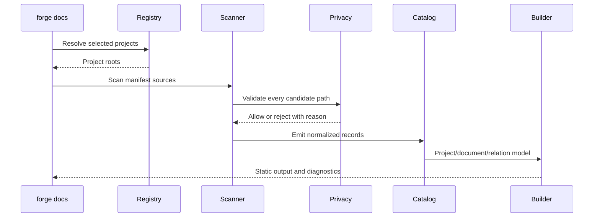

# Architecture: Forgewright Docs Hub

## Component Model

| Component | Responsibility | Proposed location |
|---|---|---|
| Manifest parser | Validate per-project docs contract | `src/cli/src/docs/manifest.ts` |
| Registry | Track enabled project roots | `src/cli/src/docs/registry.ts` |
| Scanner | Inventory allowlisted sources | `src/cli/src/docs/scanner.ts` |
| Privacy gate | Reject excluded and escaping paths | `src/cli/src/docs/privacy.ts` |
| Normalizer | Produce stable project/document/relation records | `src/cli/src/docs/normalize.ts` |
| Link resolver | Resolve documents, assets, headings, and backlinks | `src/cli/src/docs/links.ts` |
| Renderer | Build semantic HTML/CSS | `src/cli/src/docs/render.ts` |
| Search builder | Build offline search metadata | `src/cli/src/docs/search.ts` |
| Diagram adapter | Validate and render/fallback diagrams | `src/cli/src/docs/diagrams.ts` |
| GitNexus adapter | Import bounded code/process references | `src/cli/src/docs/gitnexus.ts` |
| Obsidian exporter | Export relative-link vault structure | `src/cli/src/docs/obsidian.ts` |
| CLI command | Expose init/scan/build/doctor/export | `src/cli/src/commands/docs.ts` |

## Data Flow

## Data Records

### Project

- `id`
- `title`
- `root`
- `manifestPath`
- `truthDocuments`
- `facts`
- `health`
- `scanStatus`

### Document

- `id`
- `projectId`
- `sourcePath`
- `route`
- `title`
- `type`
- `status`
- `sourceOfTruth`
- `tags`
- `headings`
- `links`
- `codeRefs`
- `warnings`
- `contentHash`

### Relation

- `from`
- `to`
- `type`
- `source`
- `confidence`

### Diagnostic

- `severity`
- `code`
- `projectId`
- `path`
- `message`
- `suggestion`

## Security Boundaries

1. Resolve canonical project root before scanning.
2. Reject paths whose resolved target escapes the root.
3. Apply built-in deny patterns before manifest includes.
4. Treat symlinks as references requiring containment validation.
5. Never execute Markdown HTML, diagram scripts, or source snippets.
6. Store evidence summaries, not raw outputs, by default.
7. Escape rendered content and restrict generated asset destinations.

## Visual Contract

### Must match

- Documentation-first hierarchy and readable code/content measure.
- Shared semantic tokens across every page.
- Light/dark parity.
- Visible focus and non-color status cues.
- Responsive behavior at 360, 768, 1024, and 1280 CSS pixels.

### May vary

- Relation colors by relation type.
- Dashboard density on wide screens.
- Optional interactive graph enhancement.

### Prohibited drift

- Per-page inline design systems.
- CDN-only core rendering.
- Marketing landing layout for document-reading screens.
- JavaScript-only navigation or diagrams.
- Unbounded graph rendering.

## Failure Model

- Invalid manifest: project fails with a diagnostic; other projects continue.
- Missing manifest: legacy fallback plus warning.
- GitNexus unavailable: portal builds with an explicit unavailable state.
- Diagram invalid: page renders source/fallback and doctor fails as configured.
- Broken link: page builds in development; strict CI fails.
- Privacy violation: scan/build blocks for the affected project.
