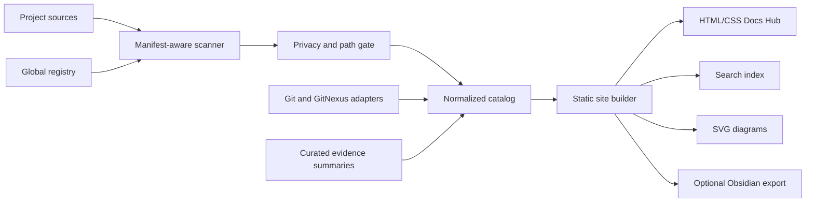

# Feature Plan: Forgewright Docs Hub

## Metadata

| Field | Value |
|---|---|
| Feature | Forgewright Docs Hub |
| Created | 2026-08-10 |
| Updated | 2026-08-10 |
| Status | Implementation complete; direct Tab traversal verification pending |
| Priority | P1 |
| Effort class | DEEP |

## Outcome

Deliver a local-first, multi-project documentation system that inventories
project-owned sources, applies a strict privacy allowlist, builds a normalized
knowledge index, and renders a searchable HTML/CSS portal with diagrams,
traceability, diagnostics, and optional Obsidian export.

Project Markdown, JSON, ADRs, GDDs, runbooks, and approved metadata remain the
source of truth. Generated HTML, indexes, SVGs, and search artifacts are
disposable build outputs.

## Minimum Safe Scope

1. Versioned per-project docs manifest.
2. Global project registry without machine-specific hardcoded roots.
3. Privacy-safe scanner and deterministic normalized JSON index.
4. Static HTML/CSS project dashboard and document viewer.
5. Offline search and relative-link resolution.
6. Build-time diagram validation with accessible fallback.
7. Git/GitNexus traceability adapters.
8. Optional Obsidian export.
9. Doctor and local CI gates.
10. Golden fixtures for Forgewright and Pixelworld.

## Deferred

- Collaborative editing or CMS behavior.
- Cloud authentication and hosted write APIs.
- LLM-generated summaries as a build dependency.
- RAG chat as a core rendering requirement.
- Automatic mass relocation or rewriting of existing documents.
- Unbounded ingestion of `.forgewright/` execution artifacts.

## Architecture Summary

## Phases

| Phase | Deliverable | Status |
|---|---|---|
| 0 | ADR, scope, architecture, decisions, schema | Completed |
| 1 | `forge docs init` and project registry | Completed |
| 2 | Scanner, privacy gate, normalized index | Completed |
| 3 | Static HTML/CSS portal MVP | Completed |
| 4 | Search, diagrams, backlinks, traceability | Completed |
| 5 | Obsidian export and compatibility shims | Completed |
| 6 | Doctor, CI, browser and accessibility verification | Completed with one browser-driver limitation noted in RETROSPECTIVE |

## Key Decisions

| Decision | Rationale |
|---|---|
| Source documents remain project-owned | Avoid a second source of truth |
| Generated output is static and disposable | Offline use, simple hosting, reproducibility |
| Privacy defaults to allowlist | Project roots can contain credentials and private artifacts |
| Physical docs layout is not migrated in MVP | Existing projects use mixed roots and naming |
| JSON index is the initial normalized store | No measured need for a database yet |
| GitNexus is an adapter, not duplicated | Preserve the existing code-graph authority |
| Obsidian is an export target | Keep compatibility without making it a hard dependency |

## Verification Strategy

- Unit: manifest parsing, path safety, stable IDs, privacy filters, link rewrite.
- Integration: scan, normalize, build, search, export.
- Golden: Forgewright, Pixelworld, empty, legacy, sensitive, and broken projects.
- Browser: navigation, search, responsive layout, theme, keyboard, 404.
- Security: traversal attempts, excluded paths, secret-shaped output.
- Visual: deterministic screenshots at 360, 768, 1024, and 1280 CSS pixels.

## Completion Criteria

- All acceptance criteria in `SCOPE.md` pass.
- Local CI succeeds without network access.
- No unresolved privacy, path traversal, or generated-output ownership risk.
- Forgewright and Pixelworld build without moving source documents.
- Generated portal remains readable without client-side JavaScript.
- Existing wiki-sync entry points either delegate to the new CLI or remain
  documented compatibility shims.

## Related Documents

- `./SCOPE.md`
- `./ARCHITECTURE.md`
- `./TASKS.md`
- `./DECISIONS.md`
- `../../../docs/adr/ADR-011-central-docs-hub.md`
