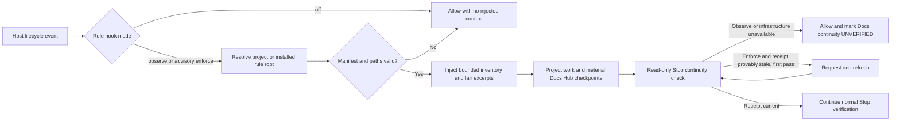

# Forgewright Docs Hub

The Docs Hub inventories approved documentation from one or more projects,
normalizes links and metadata, and generates a static HTML/CSS portal. Source
documents stay in their projects; generated catalogs, pages, search indexes,
and optional Obsidian exports are disposable outputs.

The contract is source-first and continuous: project-owned Markdown/JSON is
authoritative, while generated HTML/CSS is disposable and must never be
hand-edited. The canonical project state is `docs/project-state.json` (or the
path declared by the manifest) and owns structure, roadmap, flows, backlog, and
live status.

## Documentation write governance

Collection and rendering do not authorize creating more documents. Before any
durable documentation write, apply the canonical
[`documentation-governance.md`](../../skills/_shared/protocols/documentation-governance.md)
pre-write gate. Search current sources first, update an existing canonical
document by default, and create a new source only for a distinct durable need
and audience. Task logs, scratch plans, chat recaps, test output, generated
pages, and other transient artifacts stay outside approved source/truth sets.

Material project changes must identify and update affected canonical truth in
the same changeset. An active document that contradicts current evidence must
be corrected, archived, or marked superseded; unrelated stale debt is reported
without silently expanding the task scope. Timestamp-only edits do not prove
freshness.

## Continuous HTML refresh

For every material project update, the Docs Hub is refreshed at explicit
lifecycle events so the user can inspect the whole project as it changes. If a
project has no manifest/canonical state, or remains legacy/proportional, first
run the non-destructive `forge docs init [target]` migration; legacy readability
does not waive the HTML control center or strict final gate:

1. **Before editing:** check the current canonical state with strict doctor,
   then run a persistent `forge docs build [target]` and retain the baseline
   result.
2. **At each material checkpoint:** update the canonical `project-state.json`
   and any affected source truth first, then run persistent `forge docs build
   [target]`. A checkpoint is a meaningful implementation, documentation,
   schema, workflow, or handoff boundary—not each keystroke.
3. **Before handoff/completion:** update the final canonical state, run strict
   `forge docs gate [target]` for the selected view, and then run one final
   persistent `forge docs build [target]` so the generated site matches the
   approved sources.

Missing baseline, checkpoint, or final refresh evidence blocks handoff. The
generated HTML/CSS remains disposable and non-source: it is rebuilt from
project-owned Markdown/JSON and must never be hand-edited. The strict gate’s
temporary build is verification only and does not replace these persistent
refreshes.

## Rule-context and Stop lifecycle

Forgewright uses provider-native lifecycle hooks to keep the canonical kernel
visible without turning rule loading into a new failure point. Codex and Claude
receive context at session and subagent start, Gemini before the agent,
Antigravity before model invocation, and Cursor at session start. The hook
validates `kernel/rule-manifest.json`, emits every active canonical rule ID,
path, and source hash, then allocates the remaining character budget fairly so
an early large rule cannot hide later rules. Antigravity receives inventory
only to avoid repeating a full prompt on every invocation.



Rule-context hooks never invoke the network, edit canonical sources, or build
HTML. Their receipts contain hashes and inclusion metadata only under
`.forgewright/runtime/rule-context/`. Operational failures return the host’s
native allow response with exit code zero. The default mode is `observe`;
`FORGEWRIGHT_RULE_HOOK_MODE=off` is the kill switch, while `enforce` remains
advisory and does not block normal project work.

The separate Docs continuity check also defaults to `observe`. Setting
`FORGEWRIGHT_DOCS_CONTINUITY_MODE=enforce` permits one retry only when a
material docs change and a present build receipt are confidently identified as
stale. Missing infrastructure, malformed metadata, the second pass, and retry
state failures all allow Stop with `UNVERIFIED`; the hook never builds or
migrates a project during Stop. Global and submodule installs can repair the
runtime and lifecycle entries with:

```bash
bash scripts/hooks/forgewright-hook-doctor.sh --quick --fix
```

The installed Stop runtime is a closed adjacent bundle:
`stop-gate.sh`, `stop_gate.py`, `verify_gate.py`, `evidence_common.py`,
`continuity_check.py`, and `windows_secure_io.py`. The installer and doctor
require Python 3.11 or newer and resolve `python3`, `python`, or the Windows
`py` launcher instead of requiring one fixed executable name.
On Windows, run their shell entrypoints from Git Bash; the Python runtime may
remain native Windows CPython. Retry-state locking selects `fcntl` on POSIX and
`msvcrt` on Windows while retaining bounded state, regular-file, and
reparse-point checks.

The repair contract restores every missing or drifted member of that bundle,
then confirmation executes the installed entrypoint rather than accepting hook
configuration shape as runtime proof. Run the same smoke on every claimed host
and interpreter; the Windows release check specifically uses Git Bash with
native Windows Python 3.11 or newer:

```bash
(
  set -euo pipefail
  installed_stop="${FORGEWRIGHT_DIR:-$HOME/.forgewright}/scripts/lite/stop-gate.sh"
  smoke_dir="$(mktemp -d)"
  trap 'cd / && rmdir "$smoke_dir"' EXIT
  cd "$smoke_dir"
  unset FORGEWRIGHT_WORKSPACE
  if git rev-parse --is-inside-work-tree >/dev/null 2>&1; then
    echo "Stop smoke must run outside a Git worktree" >&2
    exit 1
  fi
  printf '%s\n' '{"hook_event_name":"Stop","turn_id":"installed-runtime-smoke","session_id":"installed-runtime-smoke","last_assistant_message":""}' |
    bash "$installed_stop" --platform CODEX |
    node -e 'const fs=require("node:fs"),assert=require("node:assert/strict"); const actual=JSON.parse(fs.readFileSync(0,"utf8")); const expected={continue:true,forgewright:{schema:"forgewright-stop-decision/v1",host_action:"allow_stop",completion_state:"verified",retry_suppressed:false,reason_code:"no_code_changes"}}; assert.deepEqual(actual,expected); console.log("installed CODEX Stop runtime: PASS")'
)
```

The README install section also provides the explicit PowerShell `bash.exe -lc`
wrapper used to record the native Windows smoke without accidentally exercising
a project-local gate.

## Safety model

- Collection is **allowlist-only**.
- Every source and symlink is resolved inside its canonical project root.
- Credential, secret, worktree, dependency, Git, and private Forgewright
  runtime paths are denied before file content is read.
- Markdown HTML is escaped rather than executed.
- Generated HTML/CSS is never treated as a source document and must never be
  hand-edited.
- Obsidian export is rejected when its destination overlaps a project root.
- A material change cannot pass the strict continuity gate without the
  canonical project state in the same changeset.

## Quickstart

Build one project:

```bash
forge docs init .
forge docs scan .
forge docs build .
forge docs doctor . --strict
forge docs gate . --worktree
```

For a staged change, use `forge docs gate . --staged`. To compare a project
with a branch or other reference, use `forge docs gate . --base-ref main`.
The gate chooses the requested change view, detects whether the change is
material, requires the configured canonical state when it is, runs strict
doctor checks in memory, builds HTML/CSS into a temporary directory, verifies
the output, and fails closed on missing or invalid evidence. It is the
postcondition used by local CI, precommit, and release enforcement; a
policy-check deny regex and a hand-edited generated page are not substitutes.

Register and build several projects:

```bash
forge docs registry add /path/to/project-a
forge docs registry add /path/to/project-b
forge docs registry list
forge docs build --all
```

The default registry is:

```text
$FORGEWRIGHT_HOME/docs-hub/projects.json
```

When `FORGEWRIGHT_HOME` is unset, it falls back to:

```text
~/.forgewright/docs-hub/projects.json
```

## Manifest

`forge docs init` creates `.forgewright/docs-manifest.json` without
overwriting an existing manifest unless `--force` is supplied.

The manifest is v1 and the parser keeps `project_docs` optional-compatible so
legacy documentation remains readable. `forge docs init` non-destructively
migrates an existing v1 manifest that lacks the block, preserves its current
sources, and creates the referenced state file only when absent. New
initialization always includes the contract.

```json
{
  "schema_version": 1,
  "project": {
    "id": "example-project",
    "title": "Example Project"
  },
  "sources": [
    {
      "path": "docs",
      "type": "documentation",
      "include": ["**/*.md", "**/*.png"]
    },
    {
      "path": "README.md",
      "type": "overview"
    }
  ],
  "project_docs": {
    "schema_version": 1,
    "state": "docs/project-state.json",
    "max_stale_days": 30
  },
  "truth": ["README.md"],
  "adapters": {
    "git": true,
    "gitnexus": true,
    "evidence_summary": false
  },
  "privacy": {
    "mode": "allowlist",
    "allow": ["docs", "README.md"],
    "exclude": ["docs/private/**"]
  }
}
```

Legacy projects without a manifest use bounded discovery for `Docs/`, `docs/`,
`documentation/`, `wiki/`, root README files, and curated project profile
metadata. The CLI reports this fallback and does not write a manifest unless
`forge docs init` is run.

Legacy scan/build remains readable for compatibility. It is not a strict
continuity contract: `forge docs gate` fails until the project has migrated to a
v1 manifest with a valid canonical project state.

## Commands

| Command                                   | Purpose                                                              |
| ----------------------------------------- | -------------------------------------------------------------------- |
| `forge docs init [target]`                | Create or validate the project manifest                              |
| `forge docs registry add <path>`          | Register a canonical project root                                    |
| `forge docs registry list`                | List configured projects                                             |
| `forge docs registry remove <id-or-path>` | Remove one registry entry                                            |
| `forge docs scan [target]`                | Produce the normalized project catalog                               |
| `forge docs build [target]`               | Build a static portal for one project                                |
| `forge docs build --all`                  | Build all registered projects                                        |
| `forge docs doctor [target]`              | Report links, anchors, diagrams, privacy, case, and staleness issues |
| `forge docs gate [target]`                | Enforce continuous Docs Hub postconditions for a material change     |
| `forge docs export obsidian [target]`     | Copy approved source documents to an external vault                  |

`forge docs gate` supports `--staged`, `--worktree`, and `--base-ref <ref>`.
Only one change view should be selected. The gate does not edit source or
generated files; it verifies the selected changeset and uses temporary output.
`--staged` validates the index snapshot rather than unstaged worktree content;
`--base-ref` validates `HEAD`; rename classification includes both source and
destination paths so a material file cannot be moved into `docs/` to bypass the
contract.

Use the root `--json` flag for a stable agent-readable envelope.

## Generated outputs

Single-project defaults:

```text
<project>/.forgewright/cache/docs-index.json
<project>/.forgewright/docs-hub/site/
```

Multi-project defaults:

```text
$FORGEWRIGHT_HOME/docs-hub/site/
$FORGEWRIGHT_HOME/docs-hub/obsidian/
```

The portal includes:

- global and project dashboards;
- semantic document pages with breadcrumbs and heading outlines;
- backlinks, related documents, and traceability relations;
- offline project-aware search;
- Mermaid flowcharts derived from canonical project-state steps, rendered as
  accessible static SVG with Mermaid source and ordered-step fallback;
- Git and GitNexus availability/staleness state;
- diagnostics, print styles, light/dark tokens, keyboard focus, and reduced
  motion support.

Core content and navigation remain readable with JavaScript disabled. The
small local script only progressively enhances search.

## Doctor and local CI

Run a strict project diagnosis:

```bash
forge docs doctor . --strict
```

Run the repository-owned documentation gate:

```bash
npm run ci:docs
```

Strict mode fails on warnings as well as errors. Normal mode fails only on
errors.

For every material project update, wire the gate as a postcondition in local CI,
precommit, or release enforcement. Keep the manifest, project-state JSON, and
Markdown sources in the changeset; never bypass a failed gate by editing
generated HTML/CSS. Missing/legacy projects initialize or migrate to the
continuous contract before material edits.

The canonical required-check runner uses `origin/main` when the current branch
contains unpushed commits and otherwise checks the worktree. Release automation
can set `FORGEWRIGHT_DOCS_BASE_REF` to the exact reviewed base revision; this
keeps same-changeset enforcement explicit and provider-neutral.

## Canonical state and migration

The state JSON declared by `project_docs.state` is the single canonical record
for structure, roadmap, flows, backlog, and live status. The normalized catalog,
static site, search index, diagrams, and Obsidian export are derived artifacts.
The public draft-07 JSON Schema validates portable structure. Cross-record
semantics—including ID uniqueness by key, reference integrity, lifecycle
agreement, timestamp ordering, and filesystem containment—are enforced by the
CLI; schema-only validation is not sufficient for acceptance. Always use strict
doctor or the continuity gate for an authoritative decision.
Update the source Markdown/JSON first, then run the gate. If the state is
missing, invalid, stale beyond `max_stale_days`, unsafe, or absent from the
selected changeset, the strict gate fails closed. `forge docs init` is the
source-preserving migration entry point; it does not move or overwrite existing
documents or an existing state file.

## Cross-project links

Use a stable project ID and project-relative source path:

```markdown
forgewright://platform-core/docs/architecture.md#runtime
```

The target project must be included in the same multi-project build. Missing
projects degrade to an explicit diagnostic rather than a fabricated link.

## Obsidian compatibility

Obsidian is an optional export, not the canonical store:

```bash
forge docs export obsidian --all
```

Exports contain copies of approved sources and generated navigation files. The
exporter never writes into source docs and does not create source symlinks.
The older `scripts/forgewright-wiki-sync*.sh` commands are retained only as
legacy compatibility paths.
